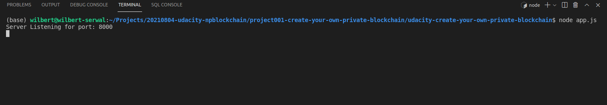
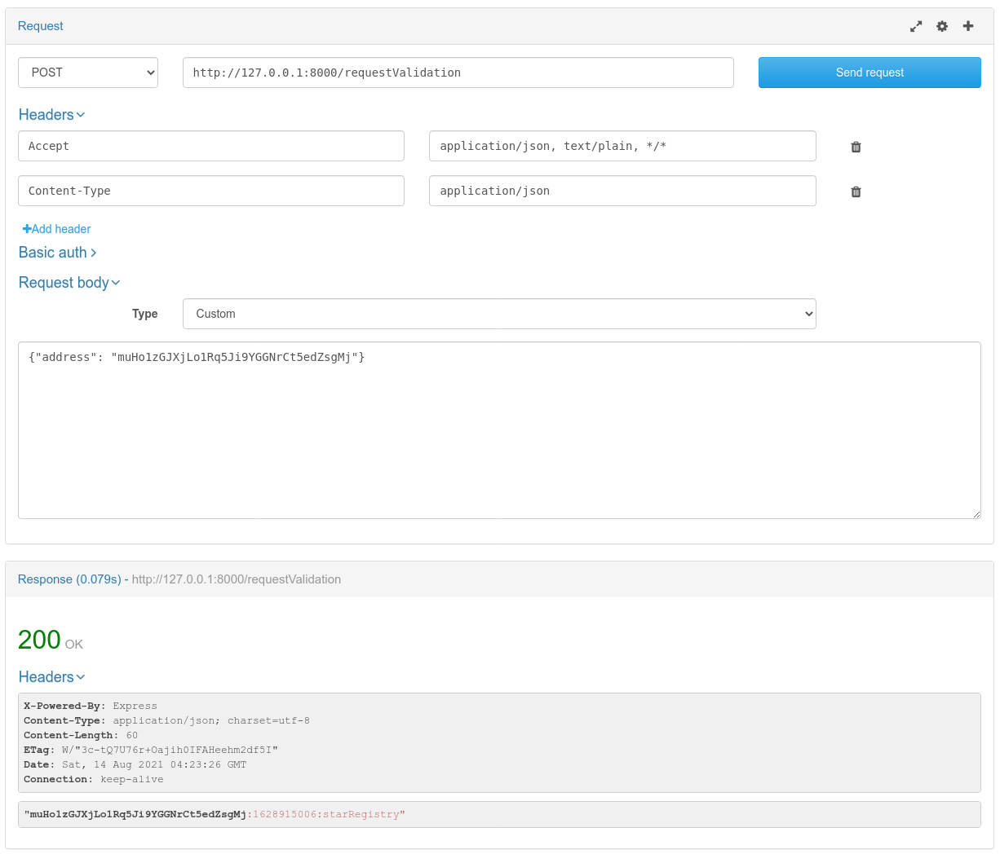
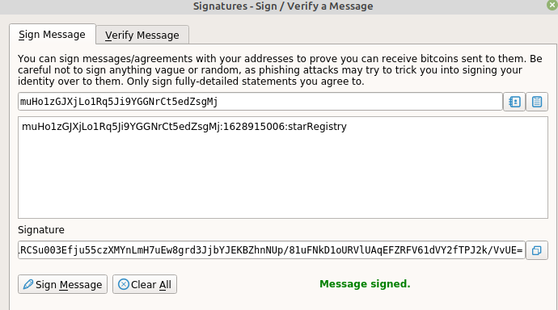
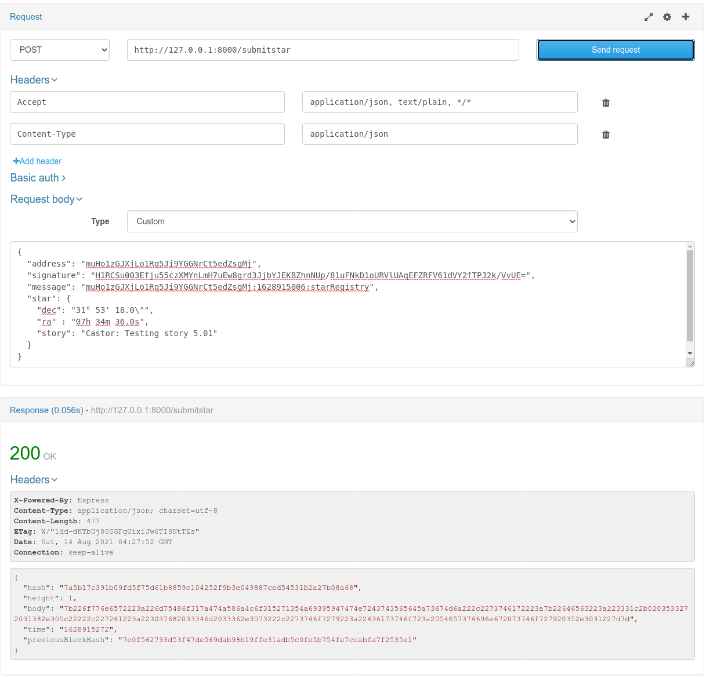
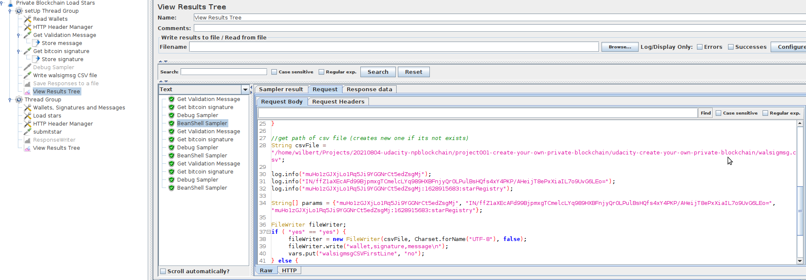
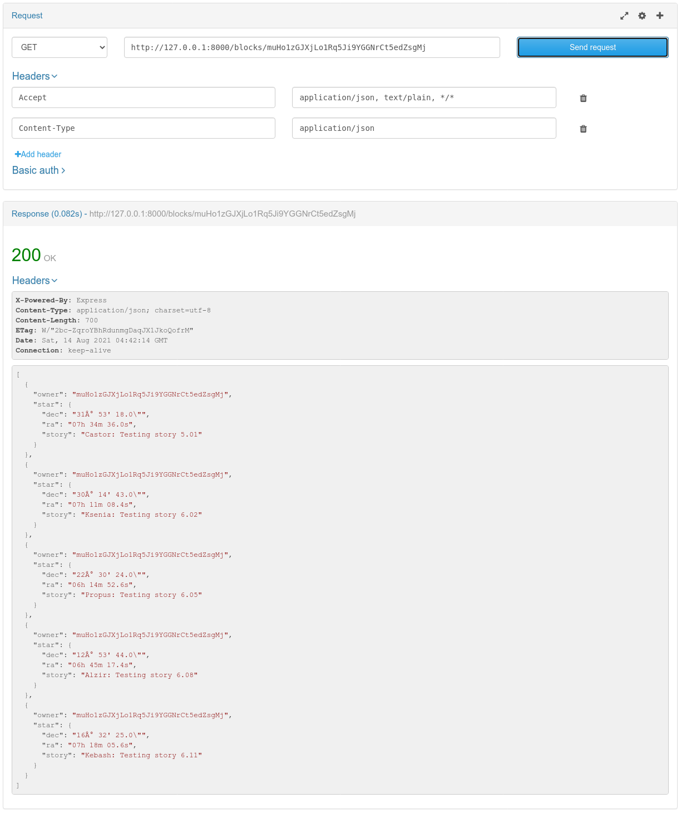
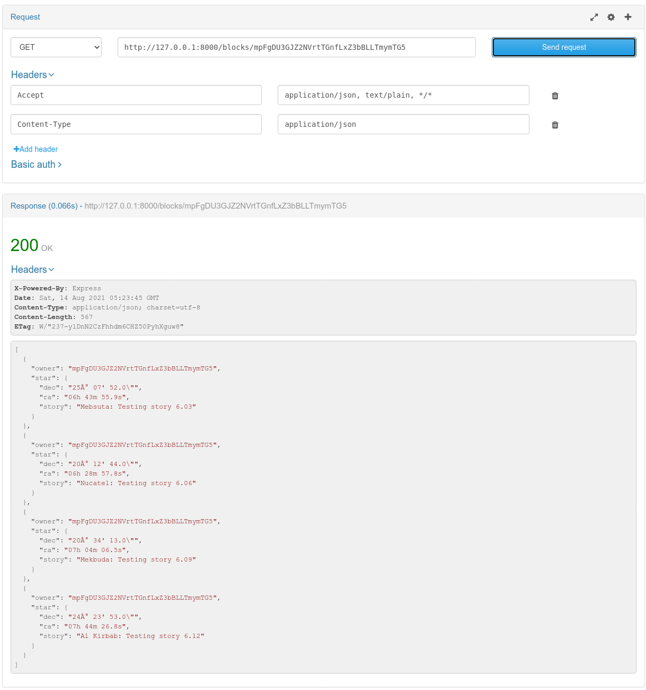
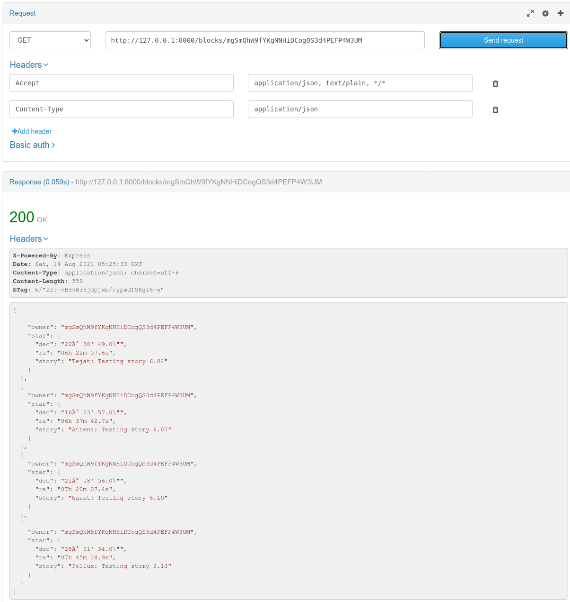
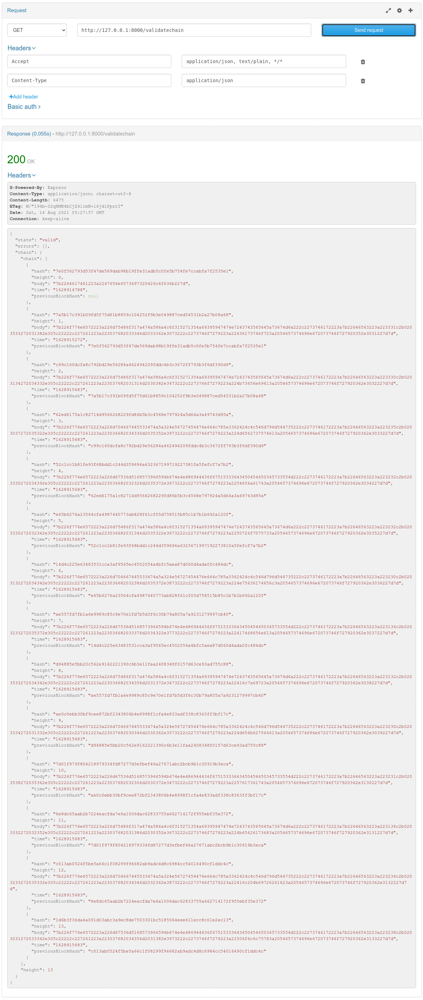

# Private Blockchain Application

You are starting your journey as a Blockchain Developer, this project allows you to demonstrate
that you are familiarized with the fundamentals concepts of a Blockchain platform.
Concepts like:
    - Block
    - Blockchain
    - Wallet
    - Blockchain Identity
    - Proof of Existance

Are some of the most important components in the Blockchain Framework that you will need to describe and also
why not? Implement too.

In this project you will have a boilerplate code with a REST Api already setup to expose some of the functionalities
you will implement in your private blockchain.

## What problem will you solve implementing this private Blockchain application?

Your employer is trying to make a test of concept on how a Blockchain application can be implemented in his company.
He is an astronomy fans and he spend most of his free time on searching stars in the sky, that's why he would like
to create a test application that will allows him to register stars, and also some others of his friends can register stars
too but making sure the application know who owned each star.

### What is the process describe by the employer to be implemented in the application?

1. The application will create a Genesis Block when we run the application.
2. The user will request the application to send a message to be signed using a Wallet and in this way verify the ownership over the wallet address. The message format will be: `<WALLET_ADRESS>:${new Date().getTime().toString().slice(0,-3)}:starRegistry`;
3. Once the user have the message the user can use a Wallet to sign the message.
4. The user will try to submit the Star object for that it will submit: `wallet address`, `message`, `signature` and the `star` object with the star information.
    The Start information will be formed in this format:
    ```json
        "star": {
            "dec": "68° 52' 56.9",
            "ra": "16h 29m 1.0s",
            "story": "Testing the story 4"
		}
    ```
5. The application will verify if the time elapsed from the request ownership (the time is contained in the message) and the time when you submit the star is less than 5 minutes.
6. If everything is okay the star information will be stored in the block and added to the `chain`
7. The application will allow us to retrieve the Star objects belong to an owner (wallet address). 


## What tools or technologies you will use to create this application?

- This application will be created using Node.js and Javascript programming language. The architecture will use ES6 classes
because it will help us to organize the code and facilitate the maintnance of the code.
- The company suggest to use Visual Studio Code as an IDE to write your code because it will help you debug the code easily
but you can choose the code editor you feel confortable with.
- Some of the libraries or npm modules you will use are:
    - "bitcoinjs-lib": "^4.0.3",
    - "bitcoinjs-message": "^2.0.0",
    - "body-parser": "^1.18.3",
    - "crypto-js": "^3.1.9-1",
    - "express": "^4.16.4",
    - "hex2ascii": "0.0.3",
    - "morgan": "^1.9.1"
    Remember if you need install any other library you will use `npm install <npm_module_name>`

Libraries purpose:

1. `bitcoinjs-lib` and `bitcoinjs-message`. Those libraries will help us to verify the wallet address ownership, we are going to use it to verify the signature.
2. `express` The REST Api created for the purpose of this project it is being created using Express.js framework.
3. `body-parser` this library will be used as middleware module for Express and will help us to read the json data submitted in a POST request.
4. `crypto-js` This module contain some of the most important cryotographic methods and will help us to create the block hash.
5. `hex2ascii` This library will help us to **decode** the data saved in the body of a Block.

## Understanding the boilerplate code

The Boilerplate code is a simple architecture for a Blockchain application, it includes a REST APIs application to expose the your Blockchain application methods to your client applications or users.

1. `app.js` file. It contains the configuration and initialization of the REST Api, the team who provide this boilerplate code suggest do not change this code because it is already tested and works as expected.
2. `BlockchainController.js` file. It contains the routes of the REST Api. Those are the methods that expose the urls you will need to call when make a request to the application.
3. `src` folder. In here we are going to have the main two classes we needed to create our Blockchain application, we are going to create a `block.js` file and a `blockchain.js` file that will contain the `Block` and `BlockChain` classes.

### Starting with the boilerplate code:

First thing first, we are going to download or clone our boilerplate code.

Then we need to install all the libraries and module dependencies, to do that: open a terminal and run the command `npm install`

**( Remember to be able to work on this project you will need to have installed in your computer Node.js and npm )**

At this point we are ready to run our project for first time, use the command: `node app.js`

You can check in your terminal the the Express application is listening in the PORT 8000

## What do I need to implement to satisfy my employer requirements?

1. `block.js` file. In the `Block` class we are going to implement the method:
    `validate()`. 
    /**
     *  The `validate()` method will validate if the block has been tampered or not.
     *  Been tampered means that someone from outside the application tried to change
     *  values in the block data as a consecuence the hash of the block should be different.
     *  Steps:
     *  1. Return a new promise to allow the method be called asynchronous.
     *  2. Save the in auxiliary variable the current hash of the block (`this` represent the block object)
     *  3. Recalculate the hash of the entire block (Use SHA256 from crypto-js library)
     *  4. Compare if the auxiliary hash value is different from the calculated one.
     *  5. Resolve true or false depending if it is valid or not.
     *  Note: to access the class values inside a Promise code you need to create an auxiliary value `let self = this;`
     */
2. `block.js` file. In the `Block` class we are going to implement the method:
    `getBData()`.
    /**
     *  Auxiliary Method to return the block body (decoding the data)
     *  Steps:
     *  
     *  1. Use hex2ascii module to decode the data
     *  2. Because data is a javascript object use JSON.parse(string) to get the Javascript Object
     *  3. Resolve with the data and make sure that you don't need to return the data for the `genesis block` 
     *     or Reject with an error.
     */
3. `blockchain.js` file. In the `Blockchain` class we are going to implement the method:
    `_addBlock(block)`.
    /**
     * _addBlock(block) will store a block in the chain
     * @param {*} block 
     * The method will return a Promise that will resolve with the block added
     * or reject if an error happen during the execution.
     * You will need to check for the height to assign the `previousBlockHash`,
     * assign the `timestamp` and the correct `height`...At the end you need to 
     * create the `block hash` and push the block into the chain array. Don't for get 
     * to update the `this.height`
     * Note: the symbol `_` in the method name indicates in the javascript convention 
     * that this method is a private method. 
     */
4. `blockchain.js` file. In the `Blockchain` class we are going to implement the method:
    `requestMessageOwnershipVerification(address)`
    /**
     * The requestMessageOwnershipVerification(address) method
     * will allow you  to request a message that you will use to
     * sign it with your Bitcoin Wallet (Electrum or Bitcoin Core)
     * This is the first step before submit your Block.
     * The method return a Promise that will resolve with the message to be signed
     * @param {*} address 
     */
5. `blockchain.js` file. In the `Blockchain` class we are going to implement the method:
    `submitStar(address, message, signature, star)`
    /**
     * The submitStar(address, message, signature, star) method
     * will allow users to register a new Block with the star object
     * into the chain. This method will resolve with the Block added or
     * reject with an error.
     * Algorithm steps:
     * 1. Get the time from the message sent as a parameter example: `parseInt(message.split(':')[1])`
     * 2. Get the current time: `let currentTime = parseInt(new Date().getTime().toString().slice(0, -3));`
     * 3. Check if the time elapsed is less than 5 minutes
     * 4. Veify the message with wallet address and signature: `bitcoinMessage.verify(message, address, signature)`
     * 5. Create the block and add it to the chain
     * 6. Resolve with the block added.
     * @param {*} address 
     * @param {*} message 
     * @param {*} signature 
     * @param {*} star 
     */
6. `blockchain.js` file. In the `Blockchain` class we are going to implement the method:
    `getBlockByHash(hash)`
    /**
     * This method will return a Promise that will resolve with the Block
     *  with the hash passed as a parameter.
     * Search on the chain array for the block that has the hash.
     * @param {*} hash 
     */
7. `blockchain.js` file. In the `Blockchain` class we are going to implement the method:
    `getStarsByWalletAddress (address)`
    /**
     * This method will return a Promise that will resolve with an array of Stars objects existing in the chain 
     * and are belongs to the owner with the wallet address passed as parameter.
     * 
     * @param {*} address 
     */
8. `blockchain.js` file. In the `Blockchain` class we are going to implement the method:
    `validateChain()`
    /**
     * This method will return a Promise that will resolve with the list of errors when validating the chain.
     * Steps to validate:
     * 1. You should validate each block using `validateBlock`
     * 2. Each Block should check the with the previousBlockHash
     */

## How to test your application functionalities?

To test your application I recommend you to use POSTMAN, this tool will help you to make the requests to the API.
Always is useful to debug your code see what is happening in your algorithm, so I will let you this video for you to check on how to do it >https://www.youtube.com/watch?v=6cOsxaNC06c . Try always to debug your code to understand what you are doing.

1. Run your application using the command `node app.js`
You should see in your terminal a message indicating that the server is listening in port 8000:
> Server Listening for port: 8000

2. To make sure your application is working fine and it creates the Genesis Block you can use POSTMAN to request the Genesis block:
    
3. Make your first request of ownership sending your wallet address:
    
4. Sign the message with your Wallet:
    
5. Submit your Star
     
6. Retrieve Stars owned by me
    

## Testscript

1. Verify application started up. Console should say:
    ```plain
    /usr/bin/node ./app.js
    Server Listening for port: 8000                                   app.js:51
    ```
    

2. Place get call to http://127.0.0.1:8000/block/height/0
    
3. Post a JSON document to http://127.0.0.1:8000/requestValidation

    ```json
    {
      "address" : "muHo1zGJXjLo1Rq5Ji9YGGNrCt5edZsgMj"
    }
    ```

    
    other addresses:
    ```json
    {
      "address": "mpFgDU3GJZ2NVrtTGnfLxZ3bBLLTmymTG5"
    }
    ```
    ```json
    {
      "address": "mgSmQhW9fYKgNNHiDCogQS3d4PEFP4W3UM"
    }
    ```
   Add screenshot of the request and response
4. Take a screenshot of signing with wallet 
    
5. Submit the star
    * Record 1: Castor

    ```json
    {
      "address": "muHo1zGJXjLo1Rq5Ji9YGGNrCt5edZsgMj",
      "signature": "",
      "message": "",
      "star": {
        "dec": "31° 53' 18.0\"",
        "ra" : "07h 34m 36.0s",
        "story": "Castor: Testing story 5.01"
      }
    }
    ```

    

6. Submit following stars for owners
    Wrote Apache JMeter functional test to submit these.
    

    * Record 2: Ksenia

    ```json
    {
      "address": "muHo1zGJXjLo1Rq5Ji9YGGNrCt5edZsgMj",
      "signature": "",
      "message": "",
      "star": {
        "dec": "30° 14' 43.0\"",
        "ra" : "07h 11m 08.4s",
        "story": "Ksenia: Testing story 6.02"
          }
    }
    ```

    * Record 3: Mebsuta

    ```json
    {
      "address": "mpFgDU3GJZ2NVrtTGnfLxZ3bBLLTmymTG5",
      "signature": "",
      "message": "",
      "star": {
        "dec": "25° 07' 52.0\"",
        "ra" : "06h 43m 55.9s",
        "story": "Mebsuta: Testing story 6.03"
      }
    }
    ```

    * Record 4: Tejat

    ```json
    {
      "address": "mgSmQhW9fYKgNNHiDCogQS3d4PEFP4W3UM",
      "signature": "",
      "message": "",
      "star": {
        "dec": "22° 30' 49.0\"",
        "ra" : "06h 22m 57.6s",
        "story": "Tejat: Testing story 6.04"
      }
    }
    ```

    * Record 5: Propus

    ```json
    {
      "address": "muHo1zGJXjLo1Rq5Ji9YGGNrCt5edZsgMj",
      "signature": "",
      "message": "",
      "star": {
        "dec": "22° 30' 24.0\"",
        "ra" : "06h 14m 52.6s",
        "story": "Propus: Testing story 6.05"
      }
    }
    ```

    * Record 6: Nucatel

    ```json
    {
      "address": "mpFgDU3GJZ2NVrtTGnfLxZ3bBLLTmymTG5",
      "signature": "",
      "message": "",
      "star": {
        "dec": "20° 12' 44.0\"",
        "ra" : "06h 28m 57.8s",
        "story": "Nucatel: Testing story 6.06"
      }
    }
    ```

    * Record 7: Athena

    ```json
    {
      "address": "mgSmQhW9fYKgNNHiDCogQS3d4PEFP4W3UM",
      "signature": "",
      "message": "",
      "star": {
        "dec": "16° 23' 57.0\"",
        "ra" : "06h 37m 42.7s",
        "story": "Athena: Testing story 6.07"
      }
    }
    ```

    * Record 8: Alzir

    ```json
    {
      "address": "muHo1zGJXjLo1Rq5Ji9YGGNrCt5edZsgMj",
      "signature": "",
      "message": "",
      "star": {
        "dec": "12° 53' 44.0\"",
        "ra" : "06h 45m 17.4s",
        "story": "Alzir: Testing story 6.08"
      }
    }
    ```

    * Record 9: Mekbuda

    ```json
    {
      "address": "mpFgDU3GJZ2NVrtTGnfLxZ3bBLLTmymTG5",
      "signature": "",
      "message": "",
      "star": {
        "dec": "20° 34' 13.0\"",
        "ra" : "07h 04m 06.5s",
        "story": "Mekbuda: Testing story 6.09"
      }
    }
    ```

    * Record 10: Wasat

    ```json
    {
      "address": "mgSmQhW9fYKgNNHiDCogQS3d4PEFP4W3UM",
      "signature": "",
      "message": "",
      "star": {
        "dec": "21° 58' 56.0\"",
        "ra" : "07h 20m 07.4s",
        "story": "Wasat: Testing story 6.10"
      }
    }
    ```

    * Record 11: Kebash

    ```json
    {
      "address": "muHo1zGJXjLo1Rq5Ji9YGGNrCt5edZsgMj",
      "signature": "",
      "message": "",
      "star": {
        "dec": "16° 32' 25.0\"",
        "ra" : "07h 18m 05.6s",
        "story": "Kebash: Testing story 6.11"
      }
    }
    ```

    * Record 12: Al Kirbab

    ```json
    {
      "address": "mpFgDU3GJZ2NVrtTGnfLxZ3bBLLTmymTG5",
      "signature": "",
      "message": "",
      "star": {
        "dec": "24° 23' 53.0\"",
        "ra" : "07h 44m 26.8s",
        "story": "Al Kirbab: Testing story 6.12"
      }
    }
    ```

    * Record 13: Pollux

    ```json
    {
      "address": "mgSmQhW9fYKgNNHiDCogQS3d4PEFP4W3UM",
      "signature": "",
      "message": "",
      "star": {
        "dec": "28° 01' 34.0\"",
        "ra" : "07h 45m 18.9s",
        "story": "Pollux: Testing story 6.13"
      }
    }
    ```

7. Request stars owned by "muHo1zGJXjLo1Rq5Ji9YGGNrCt5edZsgMj"
    Expected list of stars: Castor, Ksenia, Propus, Alzir, Kebash
    
8. Request stars owned by "mpFgDU3GJZ2NVrtTGnfLxZ3bBLLTmymTG5"
    Expected list of stars: Mebsuta, Nucatel, Mekbuda, Al Kirab
    
9. Request stars owned by "mgSmQhW9fYKgNNHiDCogQS3d4PEFP4W3UM"
    Expected list of stars: Tejat, Athena, Wasat, Pollux
    
10. Call validateChain endpoint
    Expected valid and 13 records.
    